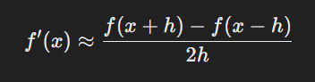
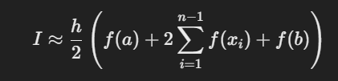
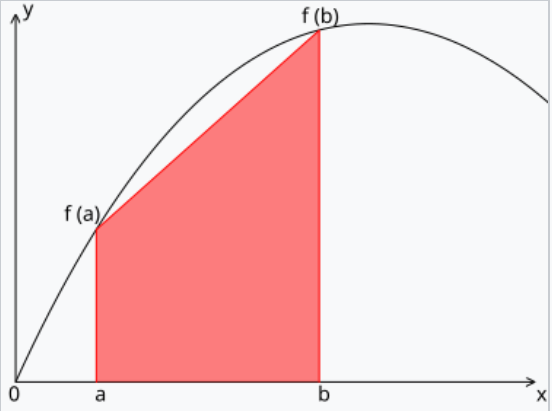
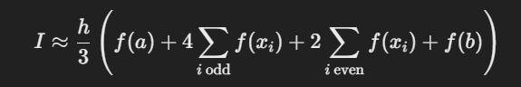
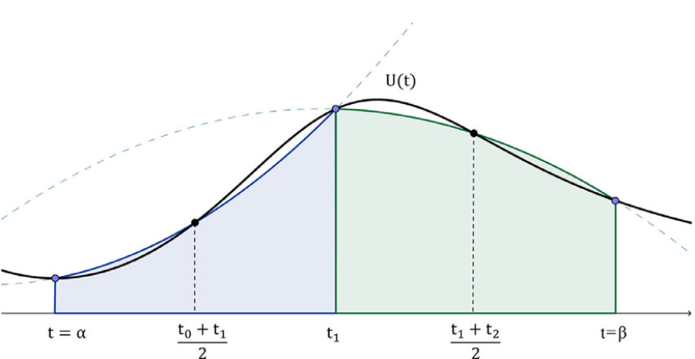

# Numerical Derivative and Integral Calculator

## Overview

This project is a numerical Derivative and Definite Integral Calculator implemented in C++. It allows users to calculate numerically approximated integration and differentiation on elemental functions. The calculator supports linear, quadratic, trigonometric, exponential, and logarithmic functions.

## Features

The calculator performs three main calculations:

1. **Derivative Calculation**: Computes the derivative of a chosen function at a specific point using the finite difference method.
   {: width=300 }

3. **Integral Calculation (Trapezoidal Rule)**: Estimates the area under a curve by dividing the interval into trapezoids.
   {: width=300 }

   {: width=300 }

5. **Integral Calculation (Simpson's Rule)**: A more accurate method for estimating the area under a curve by using parabolic segments.
   {: width=300 }

   {: width=300 }

   

## Supported Functions

The calculator supports the following types of functions:

- **Linear Function**: \( ax + b \)
- **Quadratic Function**: \( ax^2 + bx + c \)
- **Trigonometric Functions**: 
  - Sine: \( a \cdot \sin(bx) \)
  - Cosine: \( a \cdot \cos(bx) \)
  - Tangent: \( a \cdot \tan(bx) \)
- **Exponential Function**: \( a \cdot e^{bx} \)
- **Logarithmic Function**: \( a \cdot \ln(bx) \)

## How to Run the Project

1. **Clone the Repository**:
   ```bash
   git clone https://github.com/yourusername/differential-integral-calculator.git
   cd differential-integral-calculator
   ```
2. **Compile the Code**
  ```bash
  g++ main.cpp methods.cpp -o calculator -std=c++11
  ```
3. **Edit the config.txt file**
2. **Run the program**
  ```bash
  ./calculator
  ```
   
